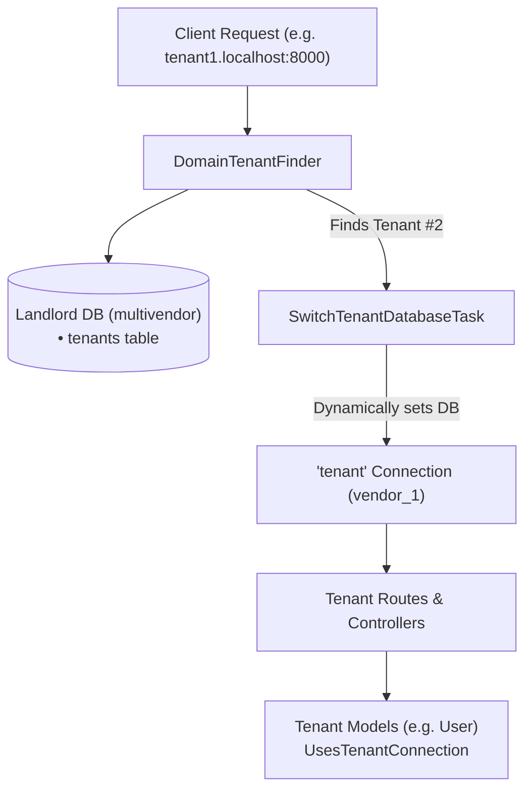

# 🏢 Laravel Multi-Tenancy (Multi-Database) Architecture

A comprehensive guide and reference implementation for **Multi-Database Multi-Tenancy** in Laravel using the **[spatie/laravel-multitenancy v4](https://spatie.be/docs/laravel-multitenancy)** package.

In this architecture, the central system (**Landlord**) lives in its own dedicated database, and every tenant has a completely isolated database (**Tenant Database**).

---

## 📑 Table of Contents

1. [Architecture & Database Separation](#-architecture--database-separation)
2. [How the Bootstrapping Lifecycle Works](#-how-the-bootstrapping-lifecycle-works)
3. [Configuration Checklist](#-configuration-checklist)
4. [Models & Connection Handling](#-models--connection-handling)
5. [Routing, Middleware & Error Handling](#-routing-middleware--error-handling)
6. [Complete Step-by-Step Bootstrapping Guide](#-complete-step-by-step-bootstrapping-guide)
7. [Local Testing with Subdomains (*.localhost)](#-local-testing-with-subdomains-localhost)
8. [Adding a New Tenant Dynamically](#-adding-a-new-tenant-dynamically)
9. [Artisan Commands Cheat Sheet](#-artisan-commands-cheat-sheet)
10. [Troubleshooting & Common Pitfalls](#-troubleshooting--common-pitfalls)

---

## 🏗️ Architecture & Database Separation



| Role | Database Name | Migrations Path | Models | Purpose |
| :--- | :--- | :--- | :--- | :--- |
| **Landlord (Central)** | `multivendor` | `database/migrations/landlord` | [`App\Models\Tenant`](file:///app/Models/Tenant.php) | Central management, tenants directory, global subscriptions & settings. |
| **Tenant 1** | `vendor_1` | `database/migrations/tenant` | [`App\Models\User`](file:///app/Models/User.php) | Isolated data for Tenant 1 (users, sessions, cache, jobs). |
| **Tenant 2** | `vendor_2` | `database/migrations/tenant` | [`App\Models\User`](file:///app/Models/User.php) | Isolated data for Tenant 2 (users, sessions, cache, jobs). |

---

## 🔄 How the Bootstrapping Lifecycle Works

1. **Incoming Request:** A request hits `http://tenant1.localhost:8000/`.
2. **Tenant Discovery:** During service provider booting (`MultitenancyServiceProvider`), [`DomainTenantFinder`](file:///vendor/spatie/laravel-multitenancy/src/TenantFinder/DomainTenantFinder.php) inspects `$request->getHost()` (`tenant1.localhost`).
3. **Database Query:** It queries `App\Models\Tenant::whereDomain($host)->first()` in the `landlord` database.
4. **Context Switching:**
   * If found, `$tenant->makeCurrent()` executes [`SwitchTenantDatabaseTask`](file:///vendor/spatie/laravel-multitenancy/src/Tasks/SwitchTenantDatabaseTask.php).
   * It dynamically configures `database.connections.tenant.database = 'vendor_1'` and purges/reconnects the `tenant` connection.
5. **Route Middleware:**
   * Routes protected with the `tenant` middleware group execute [`NeedsTenant`](file:///vendor/spatie/laravel-multitenancy/src/Http/Middleware/NeedsTenant.php) and [`EnsureValidTenantSession`](file:///vendor/spatie/laravel-multitenancy/src/Http/Middleware/EnsureValidTenantSession.php).
   * If no tenant was resolved, it throws `NoCurrentTenant`, rendering a custom 404 page.
6. **Query Execution:**
   * Models with `UsesTenantConnection` (like `User`) execute queries directly against `vendor_1`.
   * Models with `UsesLandlordConnection` (like `Tenant`) execute queries against `multivendor`.

---

## ⚙️ Configuration Checklist

### 1. Environment Variables (`.env`)
```dotenv
# The default connection for non-tenant / central operations
DB_CONNECTION=landlord
DB_HOST=127.0.0.1
DB_PORT=3306
DB_DATABASE=multivendor
DB_USERNAME=root
DB_PASSWORD=
```

### 2. Database Connections ([`config/database.php`](file:///config/database.php))
Both `landlord` and `tenant` connections must be explicitly configured:
```php
'connections' => [
    'landlord' => [
        'driver' => 'mysql',
        'host' => env('DB_HOST', '127.0.0.1'),
        'port' => env('DB_PORT', '3306'),
        'database' => env('DB_DATABASE', 'multivendor'),
        'username' => env('DB_USERNAME', 'root'),
        'password' => env('DB_PASSWORD', ''),
        'charset' => env('DB_CHARSET', 'utf8mb4'),
        'collation' => env('DB_COLLATION', 'utf8mb4_unicode_ci'),
        'prefix' => '',
        'strict' => true,
    ],

    'tenant' => [
        'driver' => 'mysql',
        'host' => env('DB_HOST', '127.0.0.1'),
        'port' => env('DB_PORT', '3306'),
        'database' => null, // Left null; set dynamically at runtime
        'username' => env('DB_USERNAME', 'root'),
        'password' => env('DB_PASSWORD', ''),
        'charset' => env('DB_CHARSET', 'utf8mb4'),
        'collation' => env('DB_COLLATION', 'utf8mb4_unicode_ci'),
        'prefix' => '',
        'strict' => true,
    ],
],
```

### 3. Multitenancy Configuration ([`config/multitenancy.php`](file:///config/multitenancy.php))
```php
// Tenant model to use
'tenant_model' => \App\Models\Tenant::class,

// Tenant Finder
'tenant_finder' => Spatie\Multitenancy\TenantFinder\DomainTenantFinder::class,

// Tasks executed when switching tenants (CRITICAL)
'switch_tenant_tasks' => [
    \Spatie\Multitenancy\Tasks\SwitchTenantDatabaseTask::class,
    // \Spatie\Multitenancy\Tasks\PrefixCacheTask::class,
],

// Connection names
'tenant_database_connection_name' => 'tenant',
'landlord_database_connection_name' => 'landlord',
```

---

## 🧩 Models & Connection Handling

To prevent tenant data from leaking into the landlord database (or vice versa), each model must explicitly declare its connection trait:

### A. Tenant Models (Stored in individual tenant databases)
Add the [`UsesTenantConnection`](file:///vendor/spatie/laravel-multitenancy/src/Models/Concerns/UsesTenantConnection.php) trait:

```php
namespace App\Models;

use Illuminate\Foundation\Auth\User as Authenticatable;
use Spatie\Multitenancy\Models\Concerns\UsesTenantConnection;

class User extends Authenticatable
{
    use UsesTenantConnection;

    protected $fillable = ['name', 'email', 'password'];
}
```

### B. Landlord Models (Stored in central `multivendor` database)
Extend [`Spatie\Multitenancy\Models\Tenant`](file:///vendor/spatie/laravel-multitenancy/src/Models/Tenant.php) (which uses `UsesLandlordConnection` by default):

```php
namespace App\Models;

use Spatie\Multitenancy\Models\Tenant as BaseTenant;

class Tenant extends BaseTenant
{
    protected $fillable = [
        'name',
        'domain',
        'database',
        'db_username',
        'db_password',
    ];

    public function url(string $path = '/'): string
    {
        $port = request()->getPort();
        $portSuffix = ($port && ! in_array($port, [80, 443])) ? ":{$port}" : '';
        return "http://{$this->domain}{$portSuffix}/" . ltrim($path, '/');
    }
}
```

---

## 🚦 Routing, Middleware & Error Handling

### 1. Middleware Group in [`bootstrap/app.php`](file:///bootstrap/app.php)
The `tenant` group ensures requests without a valid tenant are stopped:

```php
->withMiddleware(function (Middleware $middleware): void {
    $middleware->group('tenant', [
        \Spatie\Multitenancy\Http\Middleware\NeedsTenant::class,
        \Spatie\Multitenancy\Http\Middleware\EnsureValidTenantSession::class,
    ]);
})
```

### 2. Custom 404 Exception Handling in [`bootstrap/app.php`](file:///bootstrap/app.php)
When accessing an unregistered domain, `NoCurrentTenant` is caught and rendered gracefully:

```php
->withExceptions(function (Exceptions $exceptions): void {
    $exceptions->render(function (NoCurrentTenant $e, Request $request) {
        if ($request->expectsJson() || $request->is('api/*')) {
            return response()->json(['message' => 'No tenant found for this request.'], 404);
        }

        return response()->view('errors.404', [
            'message' => 'No tenant found for this request.',
        ], 404);
    });
})
```

### 3. Route Protection in [`routes/web.php`](file:///routes/web.php)
```php
Route::middleware('tenant')->group(function () {
    Route::get('/', function () {
        return view('app');
    });
});
```

---

## 🚀 Complete Step-by-Step Bootstrapping Guide

Follow these steps to set up the project from scratch:

### Step 1: Install Dependencies & Setup Environment
```bash
composer install
cp .env.example .env # If not already present
php artisan key:generate
```

Ensure MySQL is running with a user with permissions to create databases (e.g. `root`).

---

### Step 2: Migrate Landlord Database
Run only the migrations inside `database/migrations/landlord`:

```bash
php artisan migrate --path=database/migrations/landlord --database=landlord
```

> ⚠️ **Important:** Do NOT run `php artisan migrate:fresh --path=database/migrations/landlord` if you have other tables in the landlord database, as `fresh` drops all tables in the database before running the path.

---

### Step 3: Seed Tenants & Landlord Data
Seed the `tenants` table with initial records:

```bash
php artisan db:seed
```

This executes [`TenantSeeder`](file:///database/seeders/TenantSeeder.php) and:
1. Executes `CREATE DATABASE IF NOT EXISTS` for `vendor_1` and `vendor_2`.
2. Registers `localhost` (Landlord), `tenant1.localhost` (Tenant 1), and `tenant2.localhost` (Tenant 2).
3. Creates a default Landlord admin user if the `users` table exists.

---

### Step 4: Migrate All Tenant Databases
Run tenant-specific migrations across all tenant databases:

```bash
php artisan tenants:artisan "migrate --path=database/migrations/tenant --database=tenant"
```

#### ❓ What does `INFO Nothing to migrate` mean?
If you see `Nothing to migrate`, it indicates that all migrations in `database/migrations/tenant` have **already run** in that database.
* Check status anytime:
  ```bash
  php artisan tenants:artisan "migrate:status --path=database/migrations/tenant --database=tenant"
  ```
* To completely drop and re-run all tenant migrations from scratch:
  ```bash
  php artisan tenants:artisan "migrate:fresh --path=database/migrations/tenant --database=tenant"
  ```

---

### Step 5: Seed Tenant Databases (Users & Sample Data)
Seed tenant-specific data (e.g. creating tenant admin accounts):

```bash
php artisan tenants:artisan "db:seed"
```

---

### Step 6: Serve the Application
```bash
php artisan serve
```

---

## 🌐 Local Testing with Subdomains (*.localhost)

According to **[RFC 6761](https://tools.ietf.org/html/rfc6761)**, all modern web browsers (Chrome, Edge, Firefox, Brave) automatically resolve any domain ending with `*.localhost` to `127.0.0.1` without needing to modify your operating system's `hosts` file.

Open your browser and navigate to:

| URL | Environment | Switched Database | Visible Data |
| :--- | :--- | :--- | :--- |
| `http://localhost:8000` | Landlord / Central Platform | `multivendor` | Central metrics & registered tenants |
| `http://tenant1.localhost:8000` | Tenant 1 | `vendor_1` | Users belonging only to Tenant 1 |
| `http://tenant2.localhost:8000` | Tenant 2 | `vendor_2` | Users belonging only to Tenant 2 |
| `http://unknown.localhost:8000` | Unknown Tenant | None | Renders custom 404 page |

The [`resources/views/app.blade.php`](file:///resources/views/app.blade.php) template includes an interactive **Tenant Switcher** allowing you to jump between domains with a single click.

---

## ➕ Adding a New Tenant Dynamically

You can add a new tenant via code or Tinker anytime:

```php
use App\Models\Tenant;
use Illuminate\Support\Facades\DB;
use Illuminate\Support\Facades\Artisan;

// 1. Create the tenant database
$dbName = 'tenant_company_a';
DB::connection('landlord')->statement("CREATE DATABASE IF NOT EXISTS `{$dbName}`");

// 2. Insert the tenant record
$tenant = Tenant::create([
    'name' => 'Company A',
    'domain' => 'companya.localhost',
    'database' => $dbName,
]);

// 3. Migrate the new tenant's database
$tenant->execute(function () {
    Artisan::call('migrate', [
        '--path' => 'database/migrations/tenant',
        '--database' => 'tenant',
        '--force' => true,
    ]);
});
```

---

## 🛠️ Artisan Commands Cheat Sheet

| Task | Command |
| :--- | :--- |
| **Migrate landlord database** | `php artisan migrate --path=database/migrations/landlord --database=landlord` |
| **Seed landlord database** | `php artisan db:seed` |
| **Migrate all tenant databases** | `php artisan tenants:artisan "migrate --path=database/migrations/tenant --database=tenant"` |
| **Fresh migrate all tenants** | `php artisan tenants:artisan "migrate:fresh --path=database/migrations/tenant --database=tenant"` |
| **Check migration status on all tenants** | `php artisan tenants:artisan "migrate:status --path=database/migrations/tenant --database=tenant"` |
| **Migrate one specific tenant (e.g. ID 2)** | `php artisan tenants:artisan "migrate --path=database/migrations/tenant --database=tenant" --tenant=2` |
| **Seed all tenant databases** | `php artisan tenants:artisan "db:seed"` |
| **Seed one specific tenant (e.g. ID 2)** | `php artisan tenants:artisan "db:seed" --tenant=2` |
| **Run Tinker** | `php artisan tinker` |

---

## ⚠️ Troubleshooting & Common Pitfalls

### 1. `SQLSTATE[3D000]: 1046 No database selected`
* **Cause:** A model with `UsesTenantConnection` was queried when no tenant was active (e.g. in console or a landlord route).
* **Fix:** Ensure tenant-specific code runs inside a `tenant` middleware group or inside `$tenant->execute(fn() => ...)`.

### 2. Queries hit `multivendor` instead of `vendor_1`
* **Cause:** `SwitchTenantDatabaseTask::class` is commented out in `config/multitenancy.php`, OR the model is missing `UsesTenantConnection`.
* **Fix:** Enable `SwitchTenantDatabaseTask::class` under `switch_tenant_tasks` and add `use UsesTenantConnection;` to the model.

### 3. Duplicate migrations in `database/migrations` root
* **Caution:** If migration files exist in both `database/migrations/` root and `database/migrations/tenant/`, running `php artisan migrate` will run them in the landlord database. Keep tenant-specific migrations strictly inside `database/migrations/tenant`.
